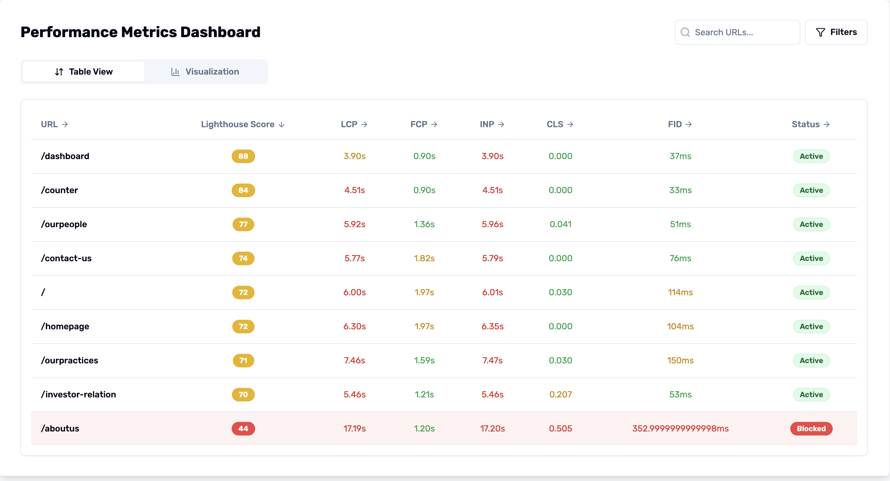
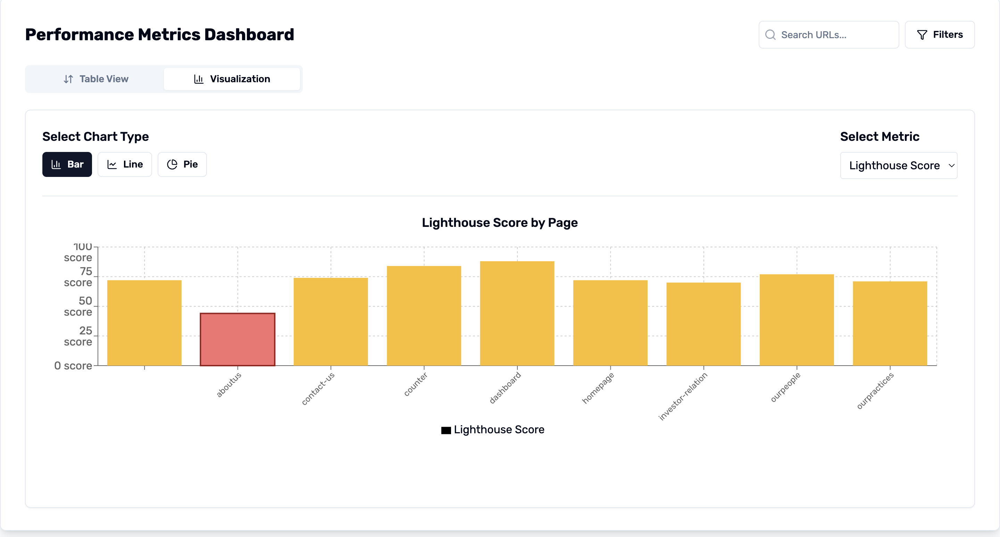
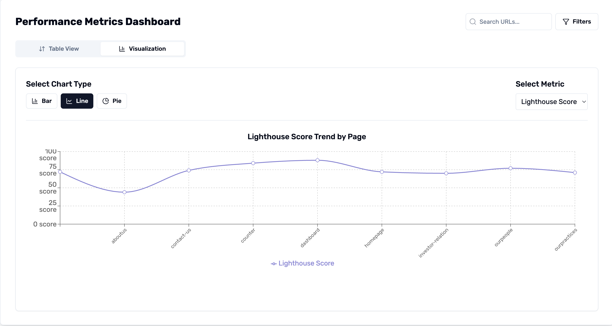
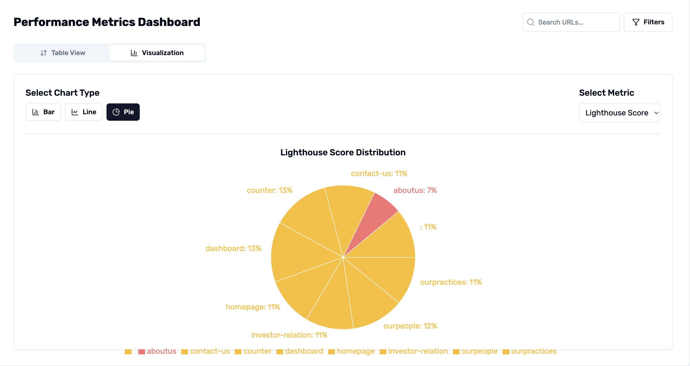
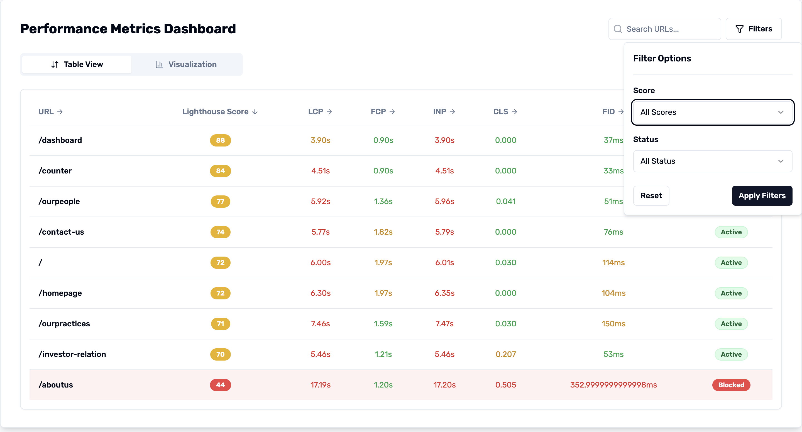
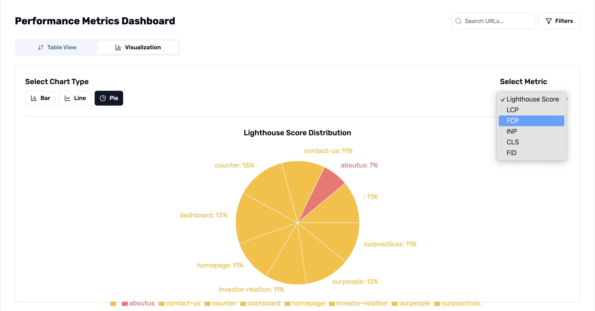

# 📊 Cwv Dashboard

A lightweight **Next.js dashboard utility** to **visualize Core Web Vitals (CWV) scores** and cwv report generated by [`cwvguard`](https://www.npmjs.com/package/cwvguard) or manually provided to it.  
Ideal for developers, QA teams, and performance engineers who want an at-a-glance view of route-level CWV performance.

---

## ✨ Dashboard








> Note: The status shown in the table will only be applicable if you are using cwvguard's middleware. All the columns in the metrics table also can be sorted on clicking the column heading. 
---

## ✨ Features

- 📊 Accepts `cwv-scores-manual.json` generated by `cwvguard`
- 📊 Accepts a optional config array as `threshold` prop to correctly visualize your data
- 🧩 Provides a plug-and-play dashboard component (`<CWVDashboard />`)
- 📈 Displays per-route CWV scores and blocking status
- ⚡ Minimal dependency, fast loading & SSR-friendly

---

## 📦 Installation

```bash
npm install cwvdashboard
```

---

## 🔧 Setup & Integration

The dashboard reads the same `cwv-scores-manual.json` file generated by `cwvguard` or manually created.

1. Install `cwvdashboard` in your Next.js project
2. Ensure `blocked-routes.json` exists at `/public/blocked-routes.json`
3. Import and render the component in any route

---

## 🧱 Usage

### 1. Render in a route or page

```tsx
// pages/cwv.tsx or app/cwv/page.tsx

import { CwvDashboard } from 'cwvdashboard'
import cwvreport from '/public/cwv-scores-manual.json'

// this config id optional and customizable according to your requirement
const config ={
  LCP:{
    green: 2.5,
    red:4 //if value exceeds this the metric is considered breeched
  },
  FCP:{
    green: 1.8,
    red:3 //if value exceeds this the metric is considered breeched
  },
  INP:{
    green: 200,
    red:500 //if value exceeds this the metric is considered breeched
  },
  CLS:{
    green: 0.1,
    red:0.25 //if value exceeds this the metric is considered breeched
  },
  FID:{
    green: 100,
    red:300 //if value exceeds this the metric is considered breeched
  }
}

const dashboard = () => {
  return (
    <div>
      <CwvDashboard cwvreport={cwvreport} threshold={config}/>
    </div>
  )
}

export default dashboard
```
> Note: a default config as per the industry standards are already pre-configured, so passing this is optional

---

## 📁 Structure Expected

Make sure this file is available and generated via `cwvguard` or manually created:

```
/public/cwv-scores-manual.json
```

Sample content:

```json
[
 {
     "url": "/",
     "LHS_Score": 70,
     "LCP": 6.106800137499999,
     "FCP": 1.9676656225000002,
     "INP": 6129.401651749999,
     "CLS": 0.02978873885368724,
     "FID": 89,
     "blocked": false
   },
   ...
]
```

---

## 🎨 Theming

- You can wrap it in your own layout or `Tailwind` classes for design customization

---

## 🔗 Related Packages

- [`cwvguard`](https://www.npmjs.com/package/cwvguard) – For generating `cwv-scores-manual.json`
- [Core Web Vitals](https://web.dev/vitals/) – Official web performance metrics

---

## 📃 License

ISC © [Karan Bengani](https://github.com/KaranBengani)

---